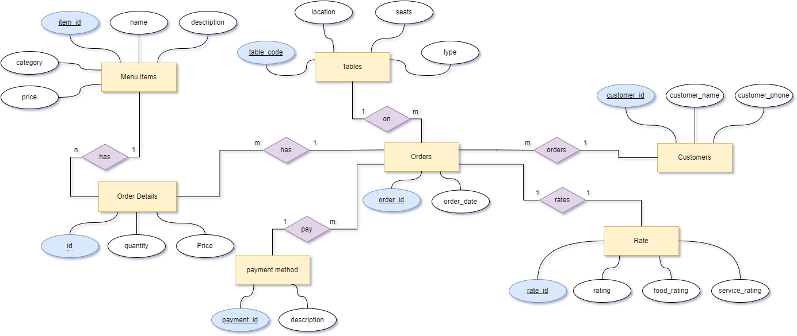

# Restaurant-Management

```
.
└── ProjectFiles/
    └── e_menu/
        ├── __init__.py
        ├── e_menu_app.py
        ├── customers/
        │   ├── __init__.py
        │   ├── customers.py
        │── models/
        ├── employees/
        │   ├── __init__.py
        │   └── employees.py
        ├── static/
        │   ├── css/
        │   ├── img/
        │   └── js/
        ├── templates/
        │   ├── customers/
        │   ├── employees/
        │   ├── 404.html
        │   ├── home_page.html
        │   └── base.html
        └── utils/
            ├── csvFiles/
            ├── queries/
            ├── __init__.py
            ├── db.py
            └── read_initial_data.py

```

## ER Diagram

## Description

- `e_menu_app.py`: Main application file, responsible for starting the application.
- `customers/`: Contains modules and models related to customer functionalities.
- `employees/`: Contains modules related to employee functionalities.
- `static/`: Holds static files such as CSS, images, and JavaScript.
- `templates/`: Stores HTML templates for different views of the application.
- `utils/`: Contains utility files including database operations and data reading functionalities.

  ## License

This project is licensed under a custom proprietary license. Permission is required from the repository owner to use this software. For more details, see the [LICENSE](./LICENSE.txt) file.

