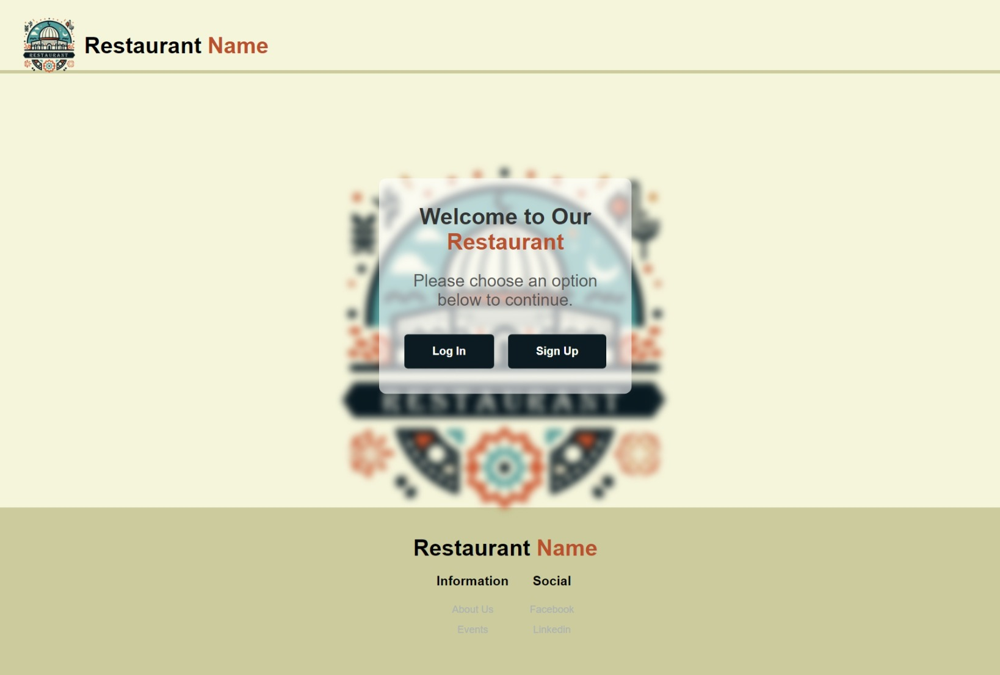
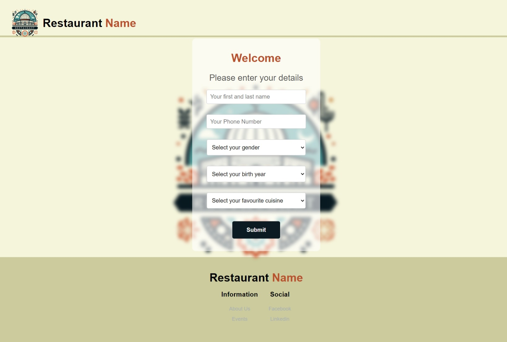
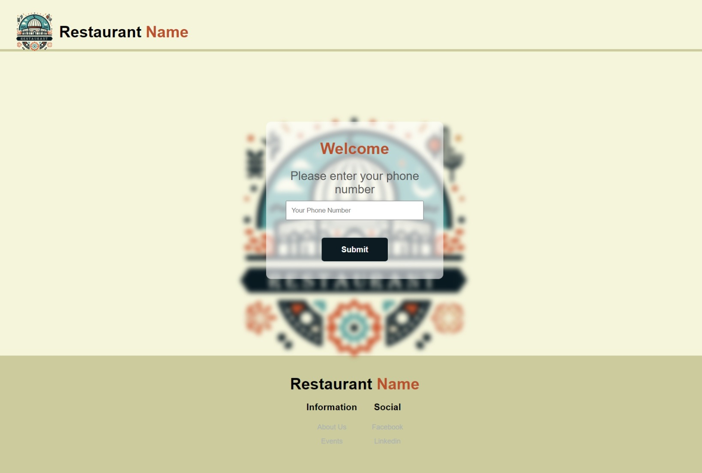
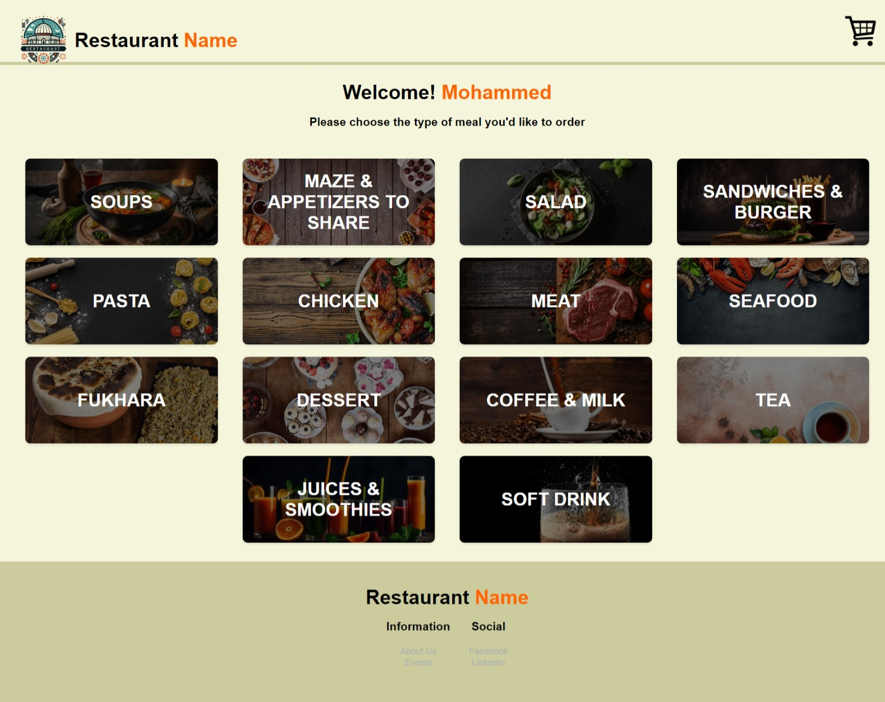
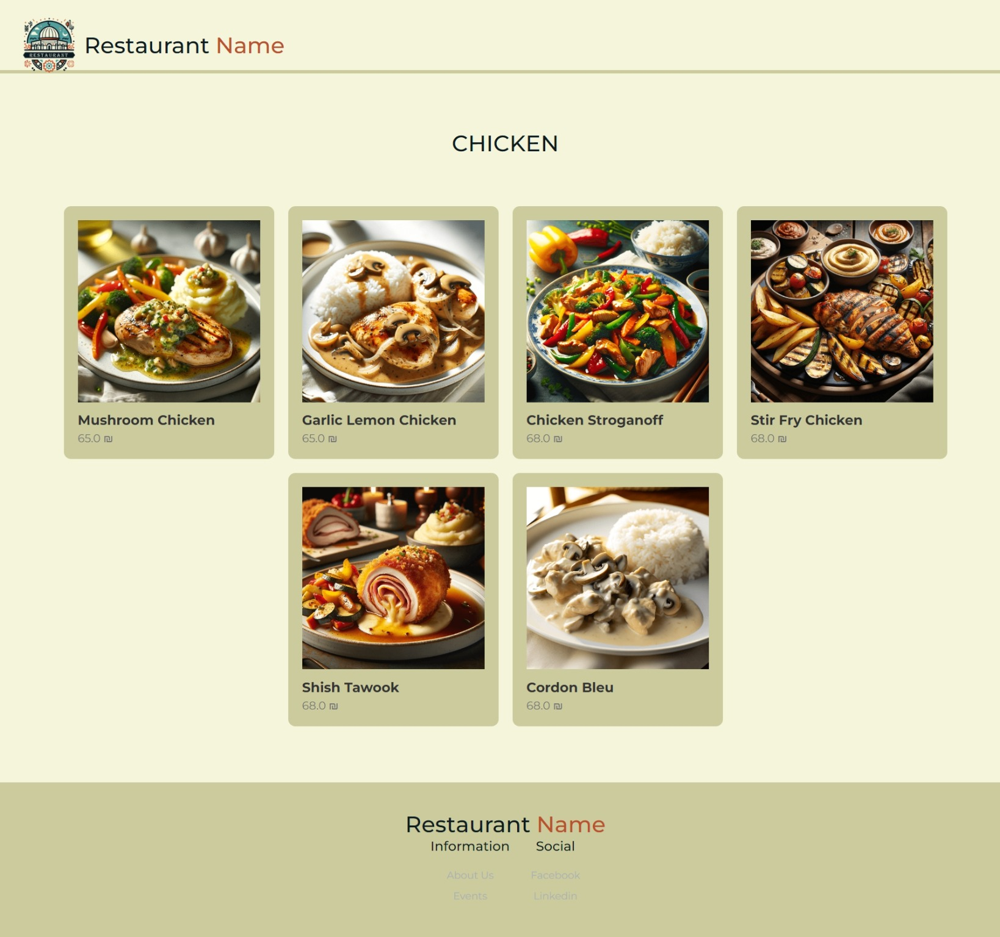
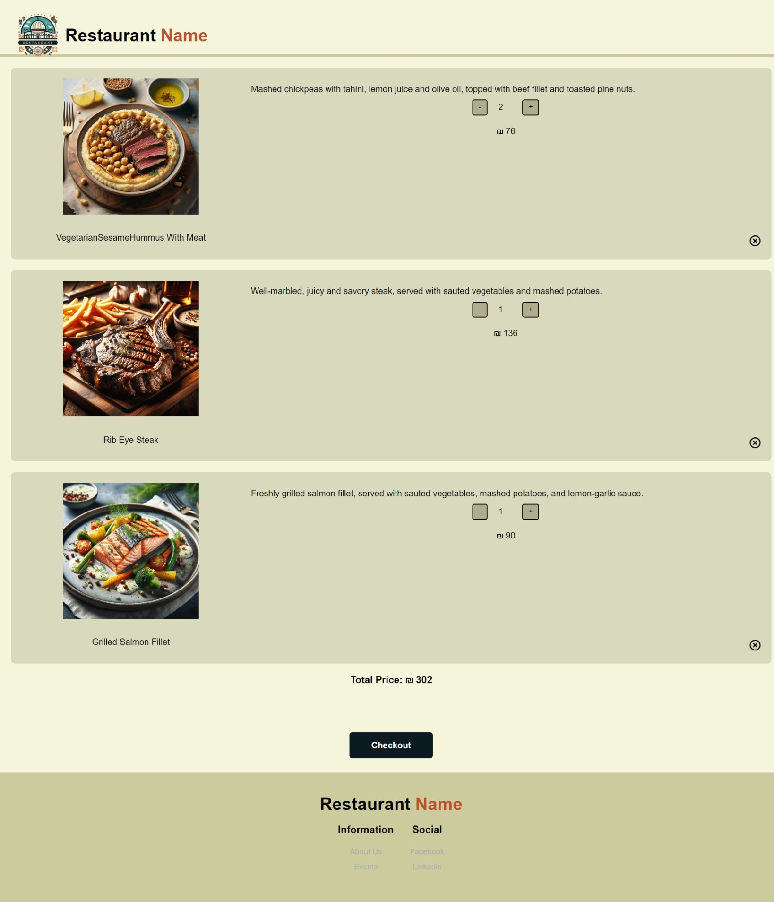
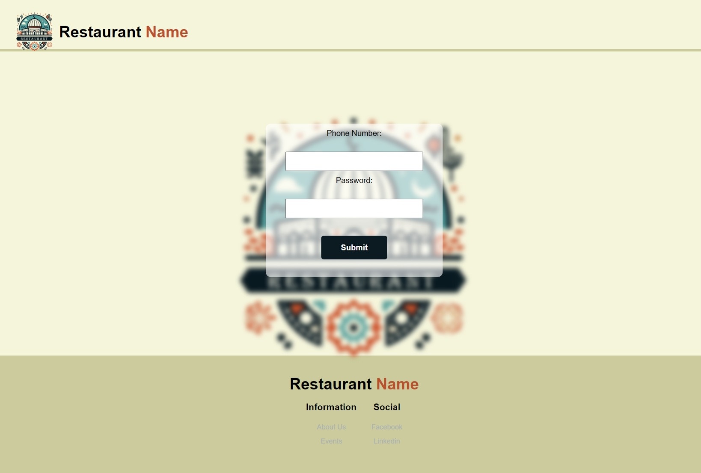
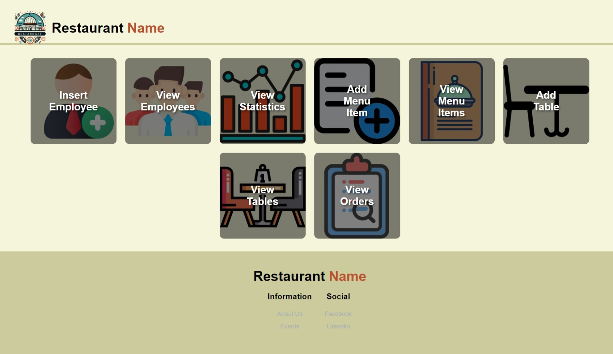
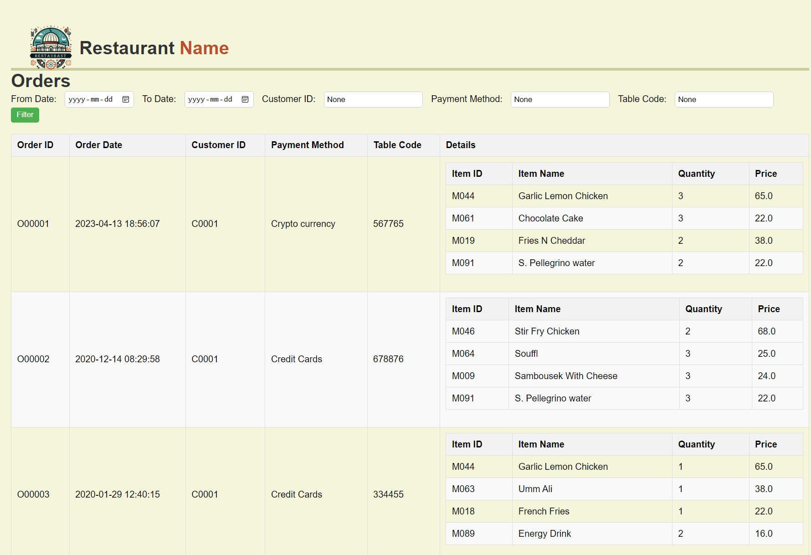
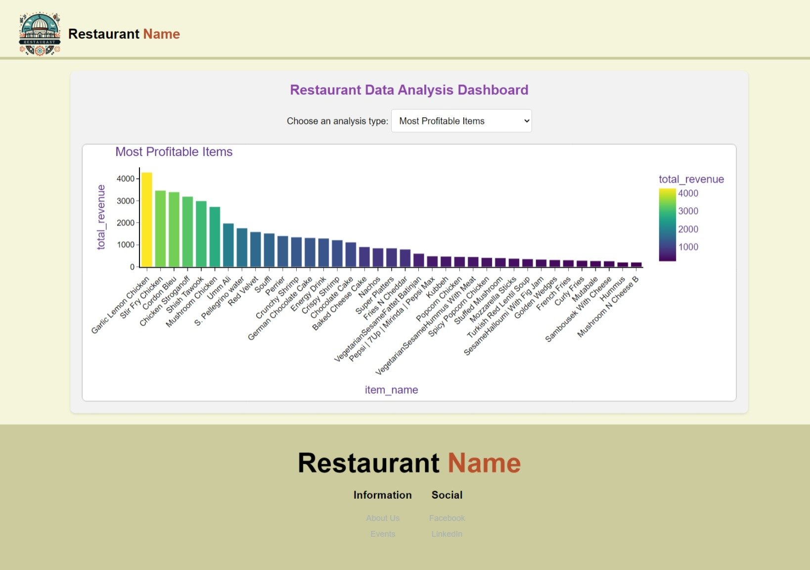

# E-Menu for Restaurants

E-Menu is a web-based application designed to enhance the dining experience at restaurants. It offers two interfaces: one for customers and another for restaurant management.

## Table of Contents

- [Features](#features)
- [Usage](#usage)
  - [Customer Interface](#customer-interface)
  - [Restaurant Management Interface](#restaurant-management-interface)
- [File Structure](#file-structure)
- [ER Diagram](#er-diagram)
- [Contributing](#contributing)
- [License](#license)

## Features

- **Customer Interface:**
  - Scan QR code to access the menu.
  - Enter table code and sign in.
  - View and order from the menu.
  - Choose payment options: VISA or cash.
  - Rate the order.

- **Restaurant Management Interface:**
  - Log in with a username and password.
  - Managing the menu
  - Tables
  - Employees
  - View order
  - Statistics.

## Usage

### Customer Interface

1. **Access Home Page:**
   - Scan the QR code provided at the restaurant table.
   - Enter the table code.
  
     

2. **Sign Up / Log In:**
   - New users can sign up.
   - Existing users can log in using their phone number.
  <div align="center">
      
    </div>
  
  <div align="center">
      
      
    </div>

3. **Browse Menu:**
   - View categories and items.
   - Add items to the cart.
   <div align="center">
      
      
    </div>
4. **Cart**
  <div align="center">
      
    </div>
   
5. **Checkout:**
   - Choose payment method (VISA or cash).
   - Confirm the order.

6. **Rate the Order:**
   - Provide feedback on the food and service.

### Restaurant Management Interface

1. **Log In:**
   - Access the management interface with a username and password.
  
     <div align="center">
       
    </div>
  
2. **Dashboard**
   <div align="center">
       
    </div>

3. **Modify Menu:**
   - Add, update, or delete menu items.
  
4. **Modify Tables:**
   - Add, update, or delete tables.
  
5. **Modify Employees Info:**
   - Add, update, or delete employees info.
  
6. **View Orders with Filters**
   - Filter orders based on date range, customer ID, table ID, payment method.
  <div align="center">
       
    </div>

7. **View Statistics:**
   - Analyze order data and performance.
  
    <div align="center">
       
    </div>

## File Structure
```plaintext
.
└── ProjectFiles/
  ├───e_menu
     ├───customers  
     ├───employees
     ├───models
     ├───static
     │   ├───css
     │   ├───img
     │   │   ├───categories
     │   │   ├───dashboard
     │   │   └───menuItems
     │   └───js
     ├───templates
     │   ├───customers
     │   └───employees
     └───utils
         ├───csvFiles
         ├───queries


```

## ER Diagram


## Contributing

Contributions are welcome! Please follow these steps to contribute:

1. Fork the repository.
2. Create a new branch (`git checkout -b feature-branch`).
3. Make your changes.
4. Commit your changes (`git commit -m 'Add new feature'`).
5. Push to the branch (`git push origin feature-branch`).
6. Open a Pull Request.

## License

This project is licensed under a custom proprietary license. Permission is required from the repository owner to use this software. For more details, see the [LICENSE](./LICENSE.txt) file.


